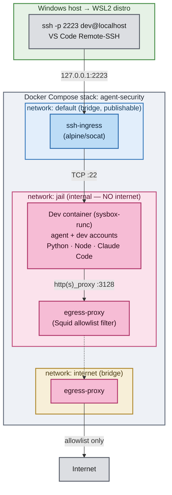

# Isolated dev container for AI agents

A reference implementation of one secure approach to running AI coding agents
during development. The agent (e.g. Claude Code) runs inside a hardened,
sysbox-isolated container that has no direct route to the internet — every
outbound connection is forced through a filtering proxy that only permits an
explicit domain allowlist. Inside the container the agent runs as an
unprivileged account with no `sudo`, kept separate from the human developer's
account.

The result is a normal, comfortable dev environment (systemd, sshd, VS Code
Remote-SSH, a ready Python toolchain) wrapped in several independent isolation
layers, so a compromised or misbehaving agent can neither reach arbitrary hosts
nor escalate to the host machine.

---

## Architecture

The whole thing is a Docker Compose stack (`docker/docker-compose.yml`, project
name `agent-security`) of three containers wired across three networks. Only one
loopback port is ever exposed to the host, and only one container can reach the
real internet.



`egress-proxy` appears in both the `jail` and `internet` networks — it is the
single bridge between them, and the only reason anything in the jail can reach
the outside world at all.

### Components

**Containers**

* **`dev` (`py-dev`)** — the actual development box and the only place an agent
  runs. It uses the `sysbox-runc` runtime, which gives it a VM-shaped container
  running real `systemd` and `sshd` without `--privileged`. Ships a Python
  toolchain (`/opt/venv` with `uv`, `pytest`, `ruff`, `black`, `mypy`, …),
  Node.js, and the Claude Code CLI. It is attached only to the internal
  `jail` network, so it has no direct internet path; all egress is pushed
  through the proxy via `http_proxy`/`https_proxy`. It holds two Unix accounts:
  `dev` (you — passwordless sudo) and `agent` (what agents run as — no sudo).

* **`egress-proxy`** — a Squid forward proxy that is the only path from the
  jail to the internet. It enforces the domain allowlist in
  `docker/squid/allowlist.txt` (Anthropic, GitHub, PyPI, npm, the VS Code server
  CDNs, apt, …); for HTTPS it matches the CONNECT host without intercepting TLS,
  and anything not on the list gets a `403`. It publishes no host ports, so
  the agent can only ever talk to it as a proxy, never log into it. Runs on
  plain `runc` — it needs no sysbox.

* **`ssh-ingress`** — a tiny `socat` relay that splices `127.0.0.1:2223` on the
  host to `py-dev:22`. It exists because Docker refuses to publish a host port
  for a container attached only to an `internal` network, so the publish lives
  here instead. It is dual-homed (`default` + `jail`), fully locked down
  (`read_only`, `cap_drop: ALL`, `no-new-privileges`), and only ever dials
  `py-dev:22` — it opens no egress path.

**Networks**

* **`jail`** (`internal: true`, subnet `172.30.0.0/24`) — the enforcement layer.
  Containers here have no route to the internet; even a tool that ignores the
  proxy env vars finds packets with nowhere to go. The subnet must match
  `acl jail` in `squid.conf`.
* **`internet`** (bridge) — an ordinary internet-connected bridge used only
  by `egress-proxy` for its allowlisted outbound calls.
* **`default`** (bridge) — the standard Compose bridge; the only network on which
  a host port (`127.0.0.1:2223`) is published, and only `ssh-ingress` sits on it.

### Security model in brief

* **sysbox** isolates the container from the host: container-root is remapped to
  an unprivileged host UID, so in-container root is not host root.
* **The `jail` network** provides fail-closed egress control — no internet route
  exists, and the Squid allowlist decides what the proxy will actually fetch.
* **Two accounts** split trust inside the container: run agents by SSHing in as
  `agent` (no sudo). Logging in as `dev` and launching an agent from that shell
  hands it dev's sudo and defeats the separation.

> ⚠️ **Accepted risk:** the `docker/` build files live inside the bind-mounted
> `/workspace` and are writable by `agent`, so a misbehaving agent could edit the
> Dockerfile and have that run on the next rebuild. This is knowingly left open
> while the agent is expected to help work on this config.
> To close it, make `docker/` root-owned (`sudo chown -R root:root docker &&
> sudo chmod 700 docker`) or move the build files out of the bind mount.

### Git & GitHub access

The container holds no GitHub credentials of its own — there is no token, no
`~/.git-credentials`, no `~/.netrc`, and no private SSH key on the box (only the
inbound `authorized_keys`). `github.com` is on the proxy allowlist, so git can
reach it over HTTPS, but authentication is brokered *live* by your editor: VS
Code's `GIT_ASKPASS` helper answers credential prompts over the Remote-SSH
tunnel using the GitHub login held on your Windows side, never writing it to
disk in the container. Two consequences worth knowing:

* `git push` / `pull` work only while a VS Code Remote-SSH session is attached —
  a headless or `agent`-only SSH session has nothing to authenticate with.
* There is no stored secret for a misbehaving agent to read or exfiltrate.

---

## Running it on Windows

### Prerequisites

* **WSL2** with an Ubuntu distro — `wsl --install -d Ubuntu` in PowerShell, then
  reboot.
* **Docker Engine** installed natively *inside* the WSL2 distro (**not** Docker
  Desktop — sysbox is incompatible with it). Official install guide:
  <https://docs.docker.com/engine/install/ubuntu/> (or the convenience script,
  `curl -fsSL https://get.docker.com | sudo sh`). Add yourself to the `docker`
  group afterwards: `sudo usermod -aG docker "$USER"`.
* **sysbox-ce** installed inside the WSL2 distro — the container runtime that
  lets the dev container run real systemd + sshd without `--privileged`. Follow
  the official install guide:
  <https://github.com/nestybox/sysbox/blob/master/docs/user-guide/install-package.md>
  (pick the release matching your Ubuntu version).
* **OpenSSH client** on Windows (ships with Windows 10/11 — check with
  `ssh -V` in PowerShell).
* **VS Code** with the Remote - SSH extension
  (`ms-vscode-remote.remote-ssh`).

---

### Step 1 — SSH key on Windows

In **PowerShell** (not WSL):

```powershell
# 1. Generate a key if you don't already have one
ssh-keygen -t ed25519 -C "you@example.com"
#    Accept the default path: C:\Users\<you>\.ssh\id_ed25519

# 2. Start the Windows ssh-agent and have it start on every boot
Get-Service ssh-agent | Set-Service -StartupType Automatic
Start-Service ssh-agent

# 3. Load the key into the agent
ssh-add $env:USERPROFILE\.ssh\id_ed25519

# 4. Confirm
ssh-add -l
```

---

### Step 2 — Verify Docker + sysbox in WSL2

Open the Ubuntu WSL2 shell. If you just added yourself to the `docker` group,
close and reopen the shell (or `wsl --shutdown` from PowerShell) so the
membership applies. Then confirm the sysbox runtime is registered:

```bash
docker info | grep -i runtimes
# Runtimes: sysbox-runc runc io.containerd.runc.v2
```

If `sysbox-runc` is missing, restart Docker (`sudo systemctl restart docker`,
or `sudo service docker restart` if systemd isn't enabled) and check again.

---

### Step 3 — Get the project onto the Linux filesystem

Keep the repo inside WSL's ext4, **not** under `/mnt/c/...` — bind-mount
performance across the 9P boundary is bad enough to be noticeable on every file
save and `pytest` run.

```bash
mkdir -p ~/projects && cd ~/projects
git clone <your-repo-url> agent-security
cd agent-security/docker
```

---

### Step 4 — Authorize your Windows key in the container

The compose file mounts `./authorized_keys` read-only into **both** accounts
(`/home/dev/.ssh/authorized_keys` and `/home/agent/.ssh/authorized_keys`).
Create it as a **file** — if it doesn't exist, Docker silently creates a
*directory* there and SSH auth fails confusingly:

```bash
cd ~/projects/agent-security/docker
cp /mnt/c/Users/<YourWindowsUser>/.ssh/id_ed25519.pub ./authorized_keys
sudo chown root:root ./authorized_keys && chmod 644 ./authorized_keys
```

`root`-ownership is required: sshd only accepts an `authorized_keys` owned by
the logging-in user or by root, and this one file serves both accounts.

Sanity check — one line, starting with `ssh-ed25519`:

```bash
cat ./authorized_keys
```

---

### Step 5 — Build and start the stack

```bash
cd ~/projects/agent-security/docker
docker compose build          # first build takes a few minutes
docker compose up -d
```

Check everything came up and that systemd booted inside `py-dev`:

```bash
docker compose ps
docker compose exec dev systemctl is-system-running     # "running" or "degraded" is fine
docker compose exec dev systemctl status ssh --no-pager
```

Smoke-test SSH **from WSL2 first** — this isolates container problems from
Windows-side problems:

```bash
ssh -p 2223 dev@localhost
```

Inside, confirm the environment:

```bash
python --version          # Python 3.12.x
which python              # /opt/venv/bin/python
ls /workspace             # your project tree
exit
```

To verify the egress lockdown is working, from inside the container an
allowlisted host should succeed and anything else should be refused with a
`403`:

```bash
curl -sSI https://pypi.org           | head -n1     # 200/301 — allowed
curl -sSI https://example.com        | head -n1     # 403 — blocked by proxy
```

---

### Step 6 — SSH from Windows into the container

WSL2 forwards `localhost` from Windows and `ssh-ingress` publishes on
`127.0.0.1:2223`, so from PowerShell:

```powershell
ssh -p 2223 dev@localhost
```

Accept the host-key fingerprint on first connect. To run an **agent**, SSH in as
the `agent` account instead — never as `dev`:

```powershell
ssh -p 2223 agent@localhost
```

#### Persist it in your SSH config

Create or edit `C:\Users\<you>\.ssh\config` (no extension):

```sshconfig
Host py-dev
    HostName localhost
    Port 2223
    User dev
    IdentityFile ~/.ssh/id_ed25519
    ServerAliveInterval 30
    ServerAliveCountMax 3

# Same container, but logged in as the unprivileged `agent` account —
# use this one to run AI agents.
Host py-dev-agent
    HostName localhost
    Port 2223
    User agent
    IdentityFile ~/.ssh/id_ed25519
    ServerAliveInterval 30
    ServerAliveCountMax 3
```

---

### Step 7 — Connect VS Code

1. Open VS Code on **Windows**.
2. `F1` → **Remote-SSH: Connect to Host…** → pick **py-dev**.
3. When asked for the platform, choose **Linux**.
4. VS Code installs its server into `/home/dev/.vscode-server` on the `dev-home`
   volume, so it survives `docker compose down` and is downloaded only once.
5. **File → Open Folder…** → `/workspace`.
6. Install the **Python** extension *Install in SSH: py-dev* (extensions install
   into the container), then `F1` → **Python: Select Interpreter** →
   `/opt/venv/bin/python`.

---

## Everyday commands

```bash
docker compose up -d          # start
docker compose stop           # stop, keep the container
docker compose down           # remove containers (named volumes survive)
docker compose down -v        # remove volumes too — wipes the home volumes
docker compose up -d --build  # rebuild and restart after editing the Dockerfile
docker compose logs -f        # systemd journal from PID 1
docker compose exec dev bash  # shell in as root, bypassing SSH

# watch what the egress proxy is allowing / denying
docker exec egress-proxy tail -f /var/log/squid/access.log
```

---

## Troubleshooting

**`docker: unknown runtime specified sysbox-runc`** — sysbox isn't registered.
Re-run its install, restart Docker, re-check `docker info | grep -i runtimes`.

**`Permission denied (publickey)`** —
1. `docker compose exec dev cat /home/dev/.ssh/authorized_keys` — if it errors
   "Is a directory", delete the stray directory, recreate the file (Step 4), then
   `docker compose up -d --force-recreate`.
2. Confirm it matches your Windows key:
   `ssh-keygen -lf $env:USERPROFILE\.ssh\id_ed25519.pub`.
3. Verbose client: `ssh -vvv -p 2223 dev@localhost`.

**Connection works from WSL but not from Windows** — `localhost` forwarding is
broken. Use the WSL IP (Step 6), or `wsl --shutdown` and restart.

**Port 2223 already in use** — change the published port in `docker-compose.yml`
(`ssh-ingress` → `ports:`) and update `Port` in your Windows SSH config.

**`systemctl` fails inside the container** — it's running under `runc`, not
sysbox. Confirm with
`docker inspect py-dev --format '{{.HostConfig.Runtime}}'`.

**A tool can't reach a host it needs** — the domain isn't allowlisted. Add it to
`docker/squid/allowlist.txt` and `docker compose restart egress-proxy`, then
check `docker exec egress-proxy tail -f /var/log/squid/access.log`.

**VS Code hangs on "Setting up SSH host"** — usually a stale server install.
From WSL: `docker compose exec dev rm -rf /home/dev/.vscode-server`, then
reconnect.
